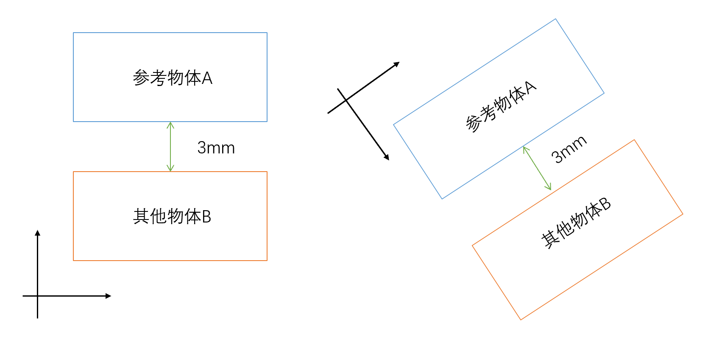

<!-- more -->

Zemax光学系统设计非序列模式

# 1. 非序列模式

Zemax软件可以使用**序列模式**和**非序列模式**两种模式来对光学系统进行设计

两种设计的区别：

序列模式 非序列模式

非序列模式首先要选定参考物体

参考物体，又称Ref Object，该物体定义了非序列全局坐标与局部坐标之间的关系，在实际使用过程中，应先确定参考物体，再确认被参考物体（工作序列中应保证参考物体位于被参考物体序列前），在实际使用可分为绝对参考和相对参考。

绝对参考：在Ref Object参数栏中直接输入要参考的物体的序列编号（编辑器中物体所处的序列号），这样物体就建立了以参考物体为原点的参考坐标系，如图所示：

